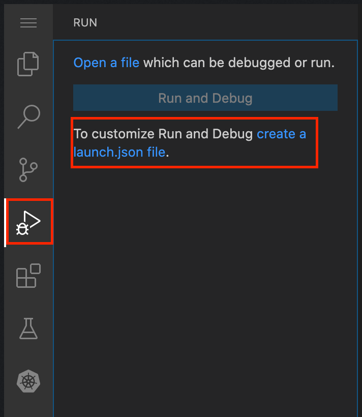
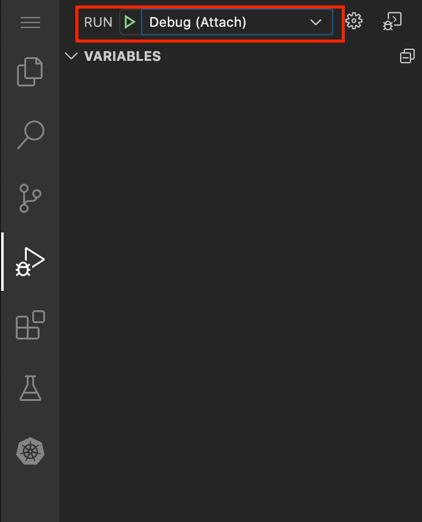

One option to debug is to set up a launcher that attaches to the remote process. This will work for any remote process (doesn’t have to be running in Kubernetes).


```dashboard:open-dashboard
name: Editor
```

On the left hand side of the IDE tab, click the Run/Debug icon

Click the `create launch.json file` like the following picture.




*   The IDE will create a default launch configuration for the current file and for `K8sDemoAppApplication`
*   Add another configuration for remote debugging

Copy and paste into youor launch.json above the first json entry.
```workshop:copy
text: |-
{
    "type": "java",
    "name": "Debug (Attach)",
    "request": "attach",
    "hostName": "localhost",
    "port": 5005
},
```

Now select the `Debug (Attached)` option from the drop down and click the Run button

This should attach the debugger to the remote port




Be sure to detach the debugger and kill the `skaffold` process before continuing
```terminal:interrupt
session: 1
```


---
