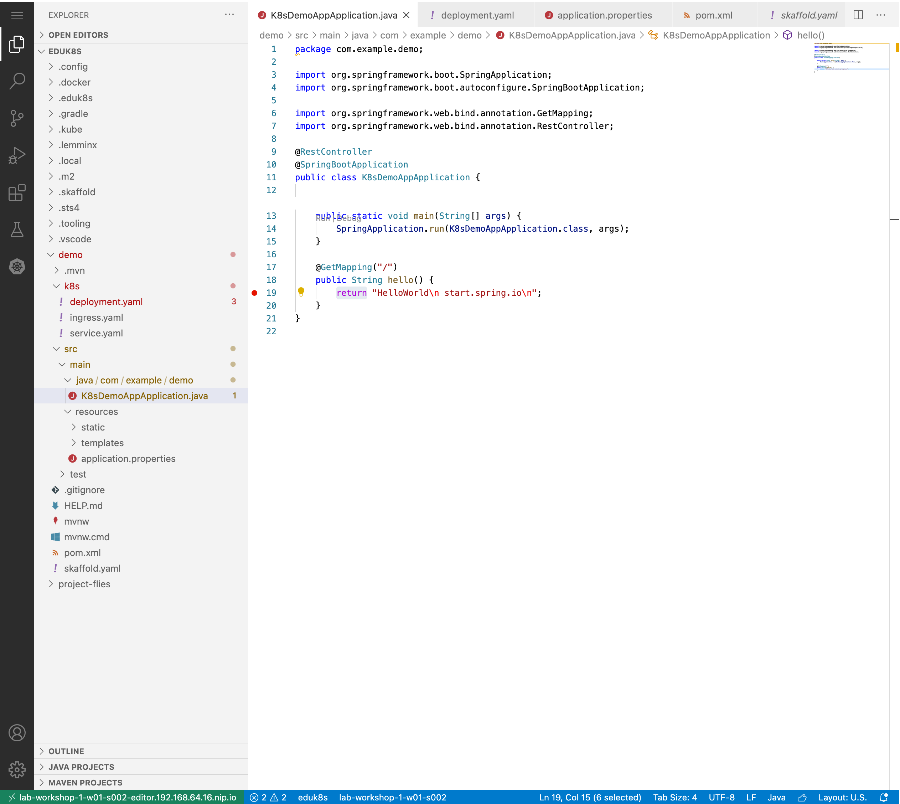

*   Skaffold also makes it easy to attach a debugger to the container running in Kubernetes


```execute-1
skaffold debug --port-forward --insecure-registry {{ registry_host }}/apps/demo --default-repo {{ registry_host }}/apps/demo
```

```bsh
...
Port forwarding service/k8s-demo-app in namespace rbaxter, remote port 80 -> address 127.0.0.1 port 4503
Watching for changes...
Port forwarding pod/k8s-demo-app-75d4f4b664-2jqvx in namespace rbaxter, remote port 5005 -> address 127.0.0.1 port 5005
...

```


The `debug` command results in two ports being forwarded    
* The http port, `4503` in the above example
* The remote debug port `5005` in the above example

You can then setup the remote debug configuration in your IDE to attach to the process and set breakpoints just like you would if the app was running locally

If you set a breakpoint where we return `Hola World` from the `hello` method in `K8sDemoApplication.java` and then issue our `curl` command to hit the endpoint you should be able to step through the code.

```editor:select-matching-text
file: ~/demo/src/main/java/com/example/demo/K8sDemoAppApplication.java
text: "return" 
```

Example: Adding breakpoint, notice the dot on the return statement (Click image to enlarge).


After setting breakpoint curl your endpoint.
```execute-2
curl localhost:80
```

To exit Skaffold in terminal one.
```terminal:interrupt
session: 1
```