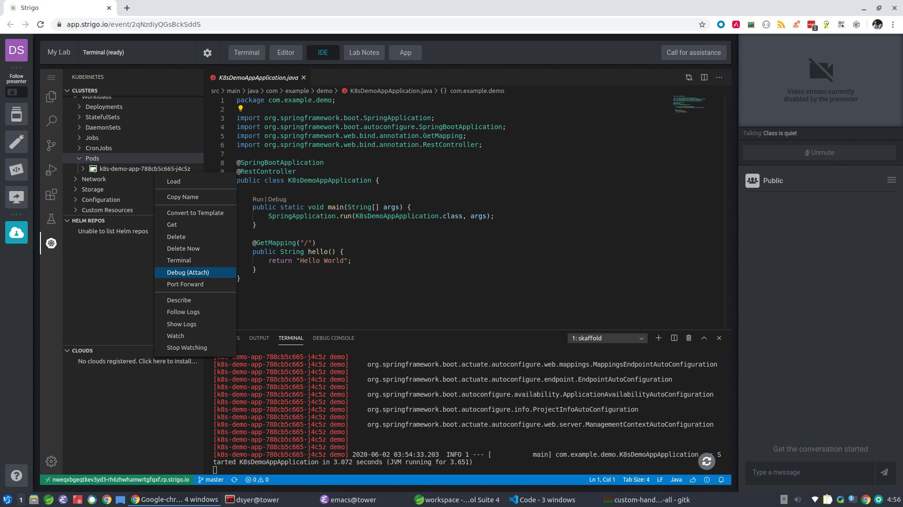

**Setting Up A Remote Debug Configuration In VS Code**

There are two options that work in VS Code locally as well as in the IDE in the lab. The first and simplest is Kubernetes specific, and that is:

*   Browse to a running Pod in the Kubernetes view
*   Right click on it and select “attach”
*   Type in the port number in the control panel that pops up (5005 is used by Skaffold by default).

